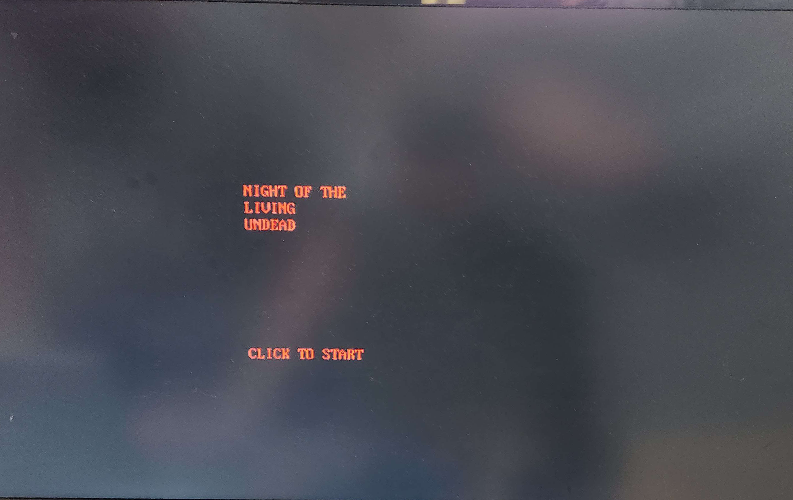
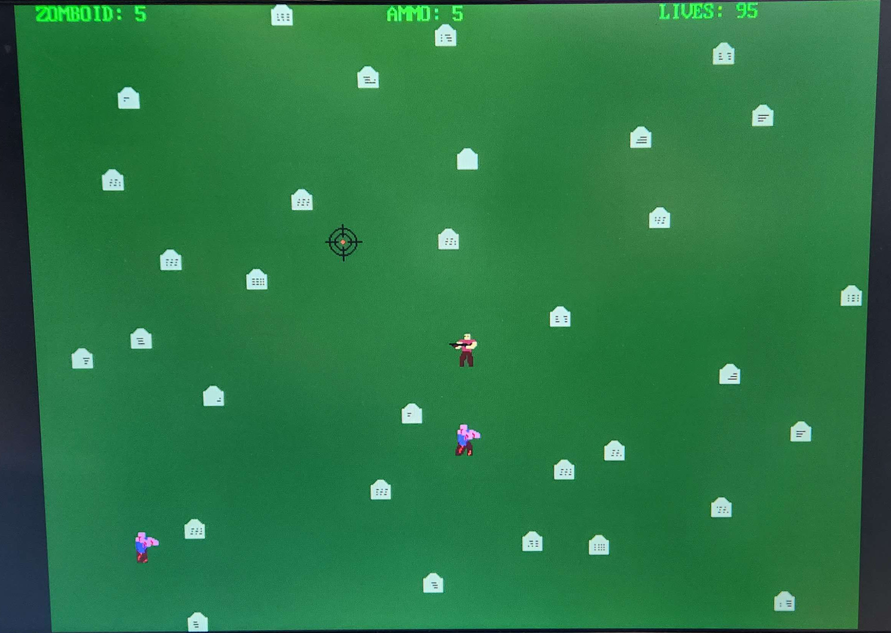

# Final Project: Night Of The Living Undead
## Team 9: Jason Luc and Kyler Martinez

### *Code Organization*
1. HDL
2. Driver
3. Test Application

### *Table of Contents*
1. Introduction
2. Audio Cores
3. Audio Drivers 
4. Music
5. Sprite Cores
6. Sprite Drivers
7. Game Characters
8. Display
9. Application Overview
10. Gamplay
11. Demo
   

### Introduction
The scope of this project is to implement a zombie-themed horde shooting arcade game using the Nexys A7 FPGA development board and the Microblaze soft core processor. The game uses the Nexys A7's PWM audio output, 12-bit VGA output, and a HID-compatible mouse for audio-visual user interaction. 

   

### Audio Cores
The audio cores used in the project are based on the ones devloped by Dr. Pong Chu and were provided by the textbook *”FPGA Prototyping by SystemVerilog Examples: Xilinx MicroBlaze MCS SoC Edition”, 2nd Edition*, but have been modifed to suit the needs of the project. Orignally the cores were set to produce sounds based on a sine wave. This has been altered to support four possible signals, a sine wave, a sawtooth wave, a random (noise) wave, and a square wave. The DFFS audio core outputs one of these signals to the ADSR core and a register control which signal is to be used. The user can write to this register to change which audio source they wish to use.

   

### Audio Driver
The DDFS and ADSR cores are controlled by the appropiate drivers. The original drivers were devloped by Dr. Chu but have been modified. The DDFS has been modified to allow the programer to change which audio source has been selected to output music. The ADSR driver has been modified to include functions to play notes that return a boolean that indictates whether the note is finished. A version of this function is implemented to accept a *Sound* object as an input.

 

### Music
#### Sound Class
The sound class is an object that stores the note of the sound, the octave the note is in, the duration of the note, and the audio source of the note.
   
#### Jukebox Class
The Jukebox class is the primary class used to control the music in the game. The class contains the melodies for music sequences such as the title theme, game over theme, and the various sound effects used. There are defintions for the different sound effects and songs avalible to be used.
 

The four primary methods are:
*  *changeSong* : set the Jukebox to play the supplied song.
*  *playSong* : play the current song loaded and return whether it is done. If the user wants to loop, restart the song.
*  *stopMusic* : stop the playing of the song. Pause or clear the Jukebox if the user chooses to.
*  *resumeMusic* : resume the song from a pause.
  

 

### Sprite Core
The SpriteCore existed in the original code developed by Dr. Chu, and was modified for the purposes of this project. A total of 4 sprites are used, 2 for the zombie entities, 1 for the player, and 1 for the custom mouse crosshair. While the mouse sprite is static and is mapped in hex, the other three sprites are palette-encoded and include four frames of animation. For a 32x32 sprite with 3-bit encoding for the pallete, four frames is the extent of the 12-bit address given to each sprite in the HDL. Sprites are updated by writing to a 5-bit control register that determines a chromakeyed color, animation playback, and current displayed animation frame.

 

### Sprite Driver
The modifications to the SpriteCore class in the overall VGA driver include several additional methods:
*  *moveDir* : moves sprite with a given horizontal and vertical speed.
*  *stop* : halts all sprite movement.
*  *get_start* : spawns a sprite along a random side of the screen, and tells it to move to a random position across the screen. 
*  *collide* : returns a boolean if the sprite collides with a given position.
*  *changeColor* : changes the color of the palette-encoded sprite.
*  *changeSprite* : changes the frame of sprite animation.

 

### Game Characters
#### Zomboid
The Zomboid class, derived from SpriteCore, is used to control the zombie enemies of the game. Each zombie spawns with 1 of 4 random colors and is animated with a walk cycle facing the direction of travel. Methods for detecting player and mouse collision are also found in the class. Only two zombies can be present on the screen at any given time. The speed of either zombie instance can be modified in the main code.
 
#### Player
The Player class controls the player animation frame for the direction the player is facing relative to the mouse crosshair. The ammunition count, number of lives, and damaged player visual effect are handled in the main application code.

 

### Display
#### Background
The background is generated using the FrameCore and having the processor write pixel values to the screen. Due to the size of memory, we could not load a pre-designed background, we had to design one that could be drawn using as little memory as possible. The bacground starts by filling it with the color green to present grass and then tombstones are drawn in various locations across the screen. Addiitonally random black pixels are drawn to represent text. A similiar process can be applied to display other objects.
 
#### On Screen Display (OSD)
The OSD is based on the code by Chu but has been modified to add functions to make string and variable display more convient for the application. Two write functions were devloped to display strings and numbers. The number version of the method returns the number of digits printed to allow for numbers to easily display in line with other text.

 

### Application Overview
The application is broken into various stages:
1. Start Screen - Display start screen, play music, and wait for user input.
2. Story Screen - Display story screen, play music, and wait for user input. Set last stand mode if user enables.
3. Gameplay Loop - User plays the game until a stop condition appears.
    1. Mouse Handler - Get mouse position, check for collisions with enemies.
    2. Reload Handler - Check if the user has finished reloading the gun.
    3. Enemy Handler - Move the enemy, check if speed needs to be changed, update sprite (animate), and check if they each center.
    4. Player Handler - Update player sprite depending on mouse location and update color if the player is attacked.
5. Game Over Screen - Display the screen based on the ending the player earned.
    1. Bad Ending - Player did not kill more than 25 zombies.
    2. Good Ending - Player killed 25 or more zombies.
    3. True Ending - Player killed 50 zombies without taking damage.
    4. Last Stand Ending - Player killed 25 or more zombies in last stand mode.
 

### Gameplay
The player spawns with 3 lives, and 6 ammunition. Pressing the left button on the mouse consumes 1 ammunition, and plays a hit or miss noise depending on if a zombie is within the crosshair. Zombies gain speed once they reach one of the center axes of the screen, and gradually get faster as the player kills more zombies and the difficulty increases. Reloading the ammunition requires a right button input with a short delay following.
 

### Demo
A video link will soon be found here: TBA
 

Below are pictures taken of our game. 
 

  
 
  
 Title Screen
 

  
 
  
 Gameplay
